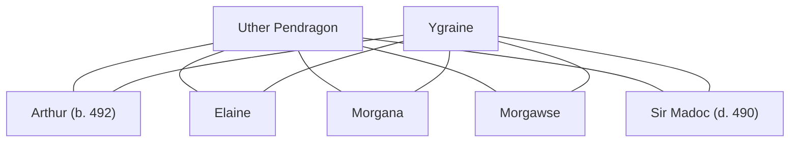

## Notes
Newborn son of [[Uther Pendragon]] and [[Ygraine]], named as heir to the kingdom. Reportedly taken by [[Merlin]] after Merlin claimed him under a prior agreement.

## Lineage

**Lineage links:**
- [[Uther Pendragon]]
- [[Ygraine]]
- [[Arthur]]
- [[Sir Madoc]]
- [[Morgana]]
- [[Morgawse]]
- [[Elaine]]

## Timeline
- **(492)** — Born to Uther and Ygraine at [[Tintagel]] and named Arthur. Servant rumor says Merlin came to claim him “as per the agreement,” Uther initially refused, and then relented after Merlin warned of a curse if the magic was not paid for. *(Source: [[Session 042 - The Treason Summons at Tintagel and the Missing Heir]])*
