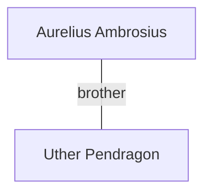

# Aurelius Ambrosius

## Notes
High King of Britain prior to [[Uther Pendragon]]’s accession.

## Timeline
- **(481)** — Leads the relief army against the Irish siege lines around [[Sarum]]. During the Battle of Downton, a [[Wyvern (Downton)]] seizes and drops him; he survives when [[Pedivere]] rides him out of danger. *(Source: [[Session 006 - The Shield of St. Crispin and the Fall of the Wyvern]])*
- **(481)** — Noted at the victory feast; attention drawn by discussion of [[Lady Ellen of Winchbank]]. *(Source: [[Session 007 — Player Synopsis — Nightly Business]])*
- **(481)** — Betrayed and killed by Bedegraine while returning from Lindsey. *(Source: [[Session 009 - The Death of Aurelius and the Fall of Bedegraine]])*

---

## Lineage

**Lineage links:**
- [[Uther Pendragon]]

