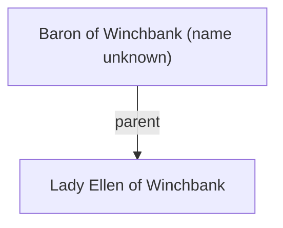

## Notes
Father of [[Lady Ellen of Winchbank]]. Host at Winchbank Castle during the delegation’s visit.

## Timeline
- **(480)** — Survives a fairy dragon attack at a feast; dismisses Silchester knights afterward. *(Source: [[Session 005 - The Fairy Dragon and the Ogre’s Return]])*
- **(480)** — Requests knighthood so he can personally lead forces to aid Salisbury; Sir Jerem agrees. *(Source: [[Session 005 - The Fairy Dragon and the Ogre’s Return]])*

---

## Lineage

**Lineage links:**
- [[Lady Ellen of Winchbank]]

