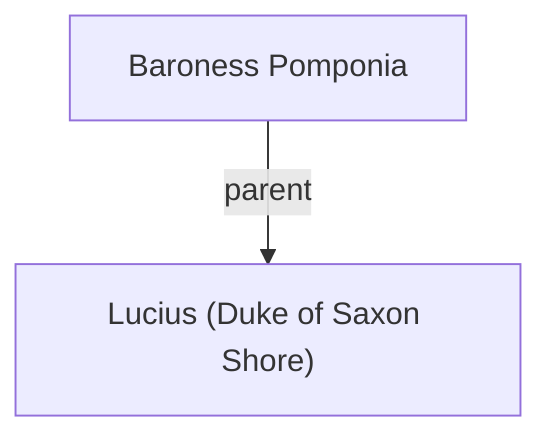

## Notes
A baroness from Frankish lands associated with the Saxon Shore. Presents her son Lucius at Easter court; seeks political protection/allies.

## Timeline
- **(483)** — Presents her son Lucius (age 4) at Easter Court; Uther knights him and makes him Duke of the Saxon Shore with a regent. *(Source: [[Session 014 - Easter Court at Sarum and the Duel of Sir Marius]])*

---

## Lineage

**Lineage links:**
- [[Baroness Pomponia]]
- [[Lucius (Duke of Saxon Shore)]]

