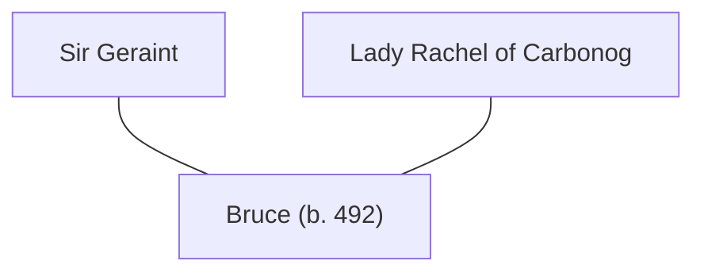

## Notes
Son of [[Sir Geraint]] and [[Lady Rachel of Carbonog]], named Bruce.

## Lineage

**Lineage links:**
- [[Sir Geraint]]
- [[Lady Rachel of Carbonog]]
- [[Bruce (son of Geraint and Rachel)]]

## Timeline
- **(491–492 / Winter)** — Recorded during winter/family phase. *(Source: [[Session 042 - The Treason Summons at Tintagel and the Missing Heir]])*
