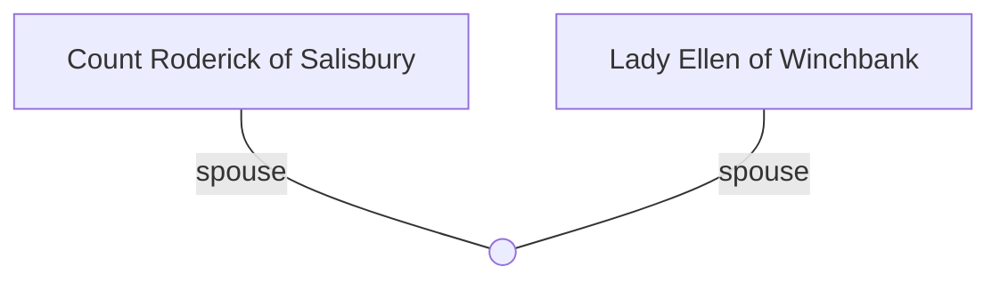

## Role
Count of Salisbury; liege lord whose household knights the PCs serve as squires.

## Timeline
- **(485–486)** — Receives the conroi’s report, sells Eosa’s golden axe for £10, and reveals Excalibur broken into three pieces; tasks the company to find Merlin and/or restore the sword. *(Source: [[Session 019 - The Well of Bargains and the Demon Princess]]; [[Session 019 — Player Synopsis — Well of Bargains and Demon Princess]])*
- **(480)** — Established as liege of the PCs' household. *(Source: [[Session 000 - The Young Squires of Salisbury]])*
- **(481)** — Asked newly knighted PCs about Lady Ellen as potential match; took wardship of Ellen after Baron's death. *(Source: [[Session 007 - The Vigil and the Knights of the High King]])*
- **(481)** — Requested investigation of Lady Llylla (Shisha) at Warwick; joined muster at Leicester for Bedegraine campaign. *(Source: [[Session 009 - The Death of Aurelius and the Fall of Bedegraine]])*
- **(482)** — Granted marriage to Lady Ellen as part of Uther's peace treaty with Summerland. *(Source: [[Session 012 - The Burning of Dunkerton and the Peace of Summerland]])*
- **(483)** — Attended Easter court at Sarum, asking knights about their passions. *(Source: [[Session 014 - Easter Court at Sarum and the Duel of Sir Marius]])*

---

## Lineage

**Lineage links:**
- [[Count Roderick of Salisbury]]
- [[Lady Ellen of Winchbank]]

