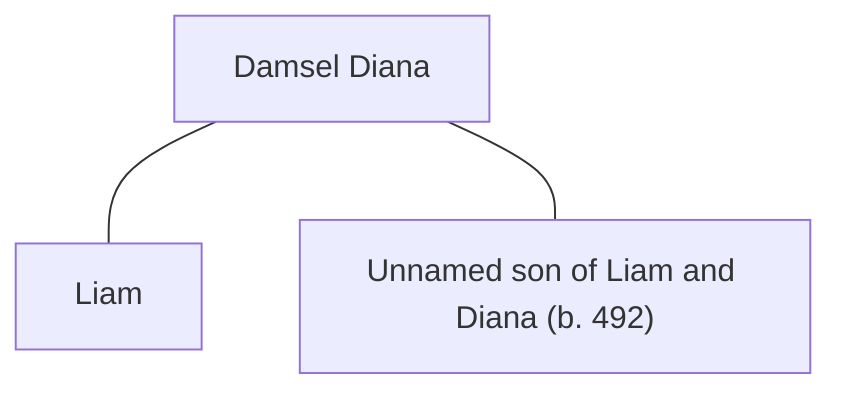

## Notes
A damsel sent by [[Lady Wells]] to warn the conroi about [[Excalibur]]. She is from a noble house in [[Summerland]] and is in service to [[King Cadwy of Summerland]].

In [[Session 024 - The Feast at Sarum and the Forest’s Warning]], she tells [[Liam]] that if Excalibur is not returned to the [[Ladies of the Lake]], the entire land will be imperiled by encroaching forests.

## Lineage

**Lineage links:**
- [[Damsel Diana]]
- [[Liam]]
- [[Unnamed son of Liam and Diana]]

## Timeline
- **(487)** — Delivers [[Lady Wells]]’ warning to Liam at the feast in [[Sarum]]. *(Source: [[Session 024 - The Feast at Sarum and the Forest’s Warning]])*
- **(490)** — Corrects [[Liam]] when he jumps too quickly toward marriage, reminding him to ask her father’s permission to court her first; Roderick has no objection but warns Uther may object. *(Source: [[Session 032 - Madoc’s Funeral and the Question of Britain’s Crown]])*

- **(491)** — Liam seeks her father in [[Summerland]] / the [[Mendip Hills]]. Her father is a druid who blesses the union only if Liam accepts a boon to poison [[Uther Pendragon|Uther]] with black liquid. Diana agrees; the marriage is not yet recorded as complete, and the courtship is revealed as a honeypot / “case red” thread. *(Source: [[Session 041 - The Feast at Caer Lloyw and the Poisoned Boon]])*
- **(491–492 / Winter)** — Conceives an unnamed male child with [[Liam]], though their marriage is still not recorded as complete. *(Source: [[Session 042 - The Treason Summons at Tintagel and the Missing Heir]])*
