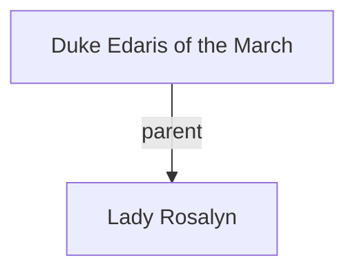

## Notes
Hosts the knights at Lambor Castle. Father of [[Lady Rosalyn]]. Wants an answer about marriage negotiations by the end of the year.

## Timeline
- **(481)** — Hosts a feast at Lambor Castle; seeks an answer regarding marriage negotiations for his daughter Rosalyn by year’s end. *(Source: [[Session 008 - The Giant King of Deira and the Fairy Road]])*

---

## Lineage

**Lineage links:**
- [[Duke Edaris of the March]]
- [[Lady Rosalyn]]

