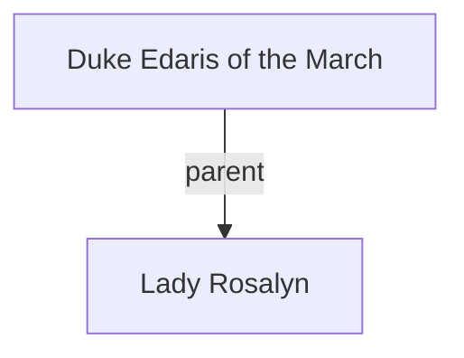

## Notes
Hosts the knights at Lambor Castle. Father of [[Lady Rosalyn]]. Wants an answer about marriage negotiations by the end of the year.

## Timeline
- **(481)** — Hosts a feast at Lambor Castle; seeks an answer regarding marriage negotiations for his daughter Rosalyn by year’s end. *(Source: [[Session 008 - The Giant King of Deira and the Fairy Road]])*

---

## Lineage

```mermaid
%% AUTO-LINEAGE: duke_edaris_of_the_march
flowchart TB
  d["Duke Edaris of the March"]
  r["Lady Rosalyn"]
  d -->|parent| r
```

**Lineage links:**
- [[Duke Edaris of the March]]
- [[Lady Rosalyn]]
- **(488)** — Tells [[Liam]] that repeated Saxon raids have devastated his lands and left his daughter difficult to marry; Liam later gains Roderick's permission to assemble aid. *(Source: [[Session 028 - The Easter Feast at the White Tower]])*

- **(489)** — With only about twenty knights and five hundred ragged footmen left, cannot shelter all peasants at [[Lambor Castle]] but provides silver and wagons for their evacuation; later offers [[Liam]] a banneret position for the capture of [[King Wihtlaeg of the Angles]]. *(Source: [[Session 030 - The Angel’s Command and the Child King]])*
