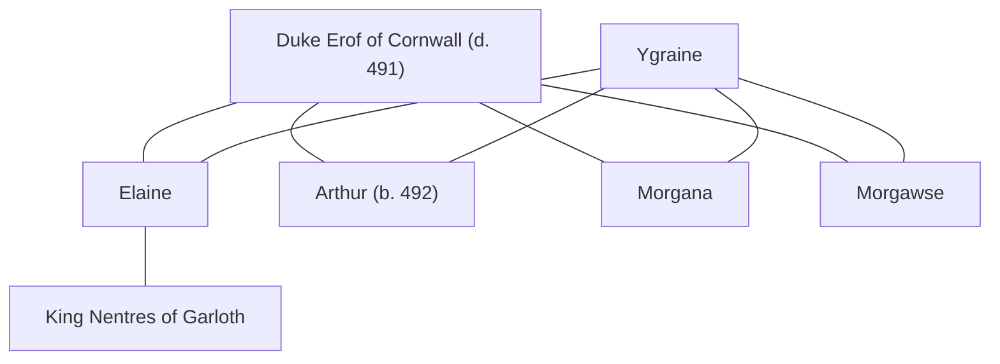

## Notes
One of [[Ygraine]]’s daughters.

## Lineage

**Lineage links:**
- [[Duke Erof of Cornwall]]
- [[Ygraine]]
- [[Elaine]]
- [[King Nentres of Garloth]]
- [[Arthur]]
- [[Morgana]]
- [[Morgawse]]

## Timeline
- **(491)** — Present at the [[Caer Lloyw]] feast when [[War Baron Ulfius|Ulfius]] and a Glastonbury churchman seek placements/suitors for Ygraine’s daughters so they are not left in Uther’s household. *(Source: [[Session 041 - The Feast at Caer Lloyw and the Poisoned Boon]])*
- **(492 / Spring)** — Married by Uther to King Nentres of Garloth during the double wedding at [[Tintagel]]. *(Source: [[Session 042 - The Treason Summons at Tintagel and the Missing Heir]])*
