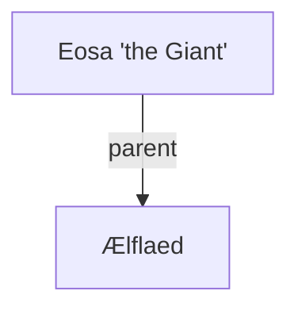

## Notes
A giant Saxon king (size compared to a horse) encountered in the Lincoln Forest near Newark. Defeated and shown mercy; withdraws after paying ransom.

## Timeline
- **(485–486)** — Receives the conroi in York, offers huscarl service and gifts a golden axe; a false Ælflaed/demonic impostor is revealed and killed in his hall. *(Source: [[Session 019 - The Well of Bargains and the Demon Princess]]; [[Session 019 — Player Synopsis — Well of Bargains and Demon Princess]])*
- **(481)** — Defeated in battle; pays ransom with a golden torque and withdraws. *(Source: [[Session 008 - The Giant King of Deira and the Fairy Road]])*
- **(481)** — The golden torque ransom becomes politically significant; Millicent reports the encounter to Roderick amid suspicions of wider conspiracies. *(Source: [[Session 009 - The Death of Aurelius and the Fall of Bedegraine]]).* 
- **(484)** — At York, hires the knights to investigate Wilderspool; offers 5 gold now and 5 on return; claims a Merlin-like Cymric man suggested taking York. *(Source: [[Session 016 - The Centurion-King, the Well of Wilderspool, and the Hag of the Dead]])*
- **(485–486)** — Defeats Uther decisively; Excalibur is shattered against his head without wounding him. *(Source: [[Session 019 - The Well of Bargains and the Demon Princess]])*

---

## Lineage

**Lineage links:**
- [[Ælflaed]]

