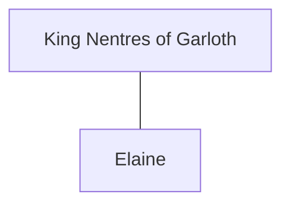

## Notes
Northern king of Garloth, described as King Lot's right-hand man / ally. Married [[Elaine]], one of [[Ygraine]]'s daughters, in Uther's spring double wedding at [[Tintagel]].

## Lineage

**Lineage links:**
- [[King Nentres of Garloth]]
- [[Elaine]]

## Timeline
- **(492 / Spring)** — Marries [[Elaine]] at the lavish double wedding at [[Tintagel]]. *(Source: [[Session 042 - The Treason Summons at Tintagel and the Missing Heir]])*
