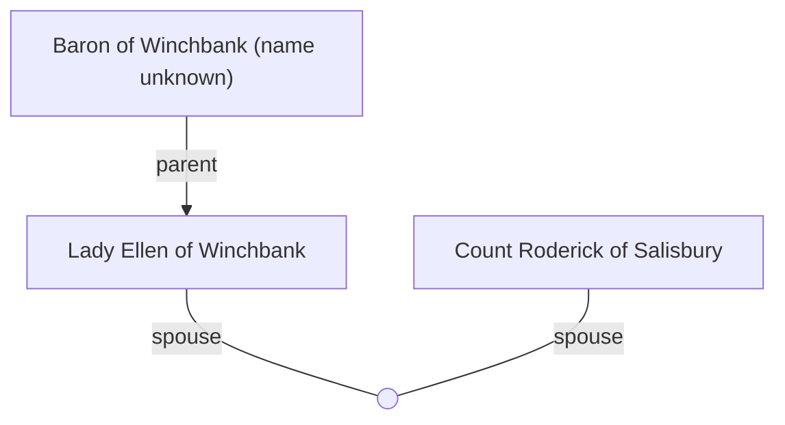

## Notes
Sole daughter and heir of the Baron of Winchbank. Considered as a politically advantageous marriage match for [[Count Roderick of Salisbury]]. Described as unskilled in courtly matters.

## Timeline
- **(480)** — Investigated as potential match for Count Roderick by Sir Jerem’s delegation. *(Source: [[Session 003 - The Empty Castle and the Forest Ambush]])*
- **(480)** — Secretly jousts at Winchbank disguised as a squire; defeats Liam. *(Source: [[Session 004 - The Lady’s Secret and the Feast at Winchbank]])*
- **(482)** — Promised in marriage to [[Count Roderick of Salisbury]] as part of the Peace of Summerland treaty. *(Source: [[Session 012 - The Burning of Dunkerton and the Peace of Summerland]])*

---

## Lineage

**Lineage links:**
- [[Lady Ellen of Winchbank]]
- [[Count Roderick of Salisbury]]

