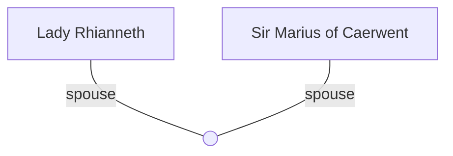

## Notes
Much younger wife of [[Sir Marius of Caerwent]]. Displays possessive/forceful interest in [[Sir Madoc]] and appears to maneuver courtly situations to her advantage.

## Timeline
- **(483)** — Draws Millicent’s attention at Easter Court; icy/smug presence around Madoc and Marius. *(Source: [[Session 014 - Easter Court at Sarum and the Duel of Sir Marius]]).* 
- **(483)** — Forces a kiss on Madoc in Sarum’s gardens; later laughs after Marius is beheaded by Asterius. *(Source: [[Session 014 - Easter Court at Sarum and the Duel of Sir Marius]])*

---

## Lineage

**Lineage links:**
- [[Lady Rhianneth]]
- [[Sir Marius of Caerwent]]

