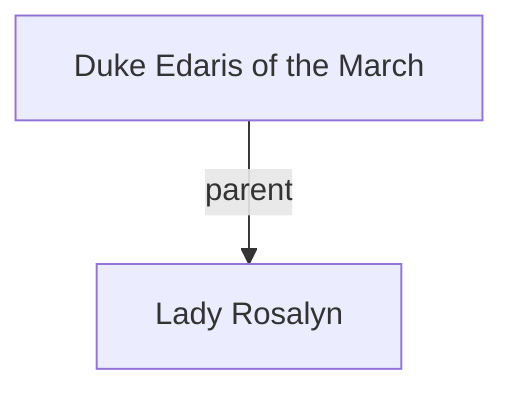

## Notes
Daughter of the Duke of the March; evaluated as a potential marriage candidate for Count Roderick. Kind and charitable (possibly too generous). Observers note she seems more interested in Millicent than in male suitors.

## Timeline
- **(481)** — Evaluated at Lambor Castle as a potential marriage candidate for Count Roderick; noted for kindness and unusual attention to Millicent. *(Source: [[Session 008 - The Giant King of Deira and the Fairy Road]])*

---

## Lineage

**Lineage links:**
- [[Duke Edaris of the March]]
- [[Lady Rosalyn]]

