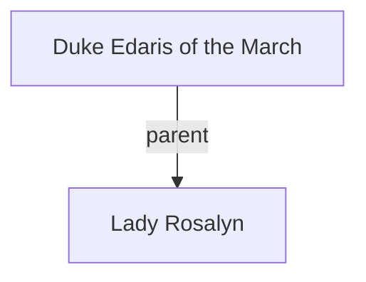

## Notes
Daughter of the Duke of the March; evaluated as a potential marriage candidate for Count Roderick. Kind and charitable (possibly too generous). Observers note she seems more interested in Millicent than in male suitors.

## Timeline
- **(481)** — Evaluated at Lambor Castle as a potential marriage candidate for Count Roderick; noted for kindness and unusual attention to Millicent. *(Source: [[Session 008 - The Giant King of Deira and the Fairy Road]])*

---

## Lineage

```mermaid
%% AUTO-LINEAGE: lady_rosalyn
flowchart TB
  d["Duke Edaris of the March"]
  r["Lady Rosalyn"]
  d -->|parent| r
```

**Lineage links:**
- [[Duke Edaris of the March]]
- [[Lady Rosalyn]]

- **(489)** — Argues to protect peasants outside [[Lambor Castle]], helps [[Drustin]] escort the refugee train safely to [[Salisbury]], and begins a courtship with him. *(Source: [[Session 030 - The Angel’s Command and the Child King]])*
- **(490)** — Shows interest in [[Drustin]] after he tells her a fairy tale, but says he needs her father’s permission; Duke Edaris will only consider him if he becomes a banneret. *(Source: [[Session 032 - Madoc’s Funeral and the Question of Britain’s Crown]])*
