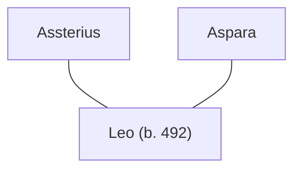

## Notes
Son of [[Assterius]] and [[Squire Aspara|Aspara]], named Leo after a dead man/father figure.

## Lineage

**Lineage links:**
- [[Assterius]]
- [[Squire Aspara]]
- [[Leo (son of Assterius and Aspara)]]

## Timeline
- **(491–492 / Winter)** — Conceived during winter/family phase. *(Source: [[Session 042 - The Treason Summons at Tintagel and the Missing Heir]])*
