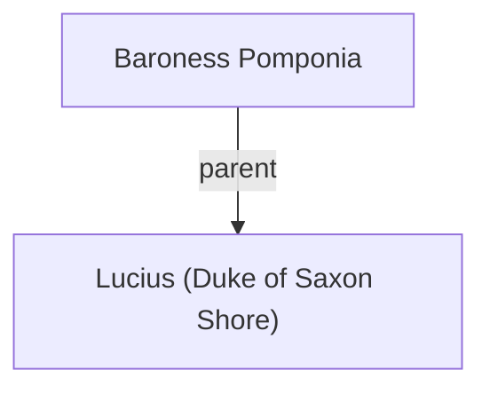

## Notes
A four-year-old child knighted by Uther at Easter court and proclaimed Duke of the Saxon Shore; governed by a regent aunt.

## Timeline
- **(483)** — Knighted by Uther at Easter Court (age 4) and proclaimed Duke of the Saxon Shore; an aunt serves as regent. *(Source: [[Session 014 - Easter Court at Sarum and the Duel of Sir Marius]])*

---

## Lineage

**Lineage links:**
- [[Baroness Pomponia]]
- [[Lucius (Duke of Saxon Shore)]]

