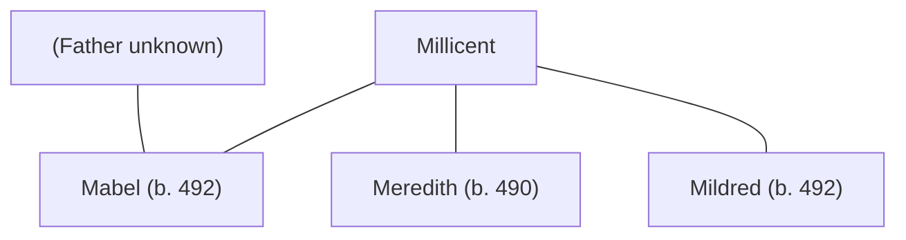

## Notes
Twin daughter of [[Millicent]], conceived after the Caer Lloyw/Jagent year-end. Millicent spends 1 prestige to keep the twins healthy.

## Lineage

**Lineage links:**
- [[Millicent]]
- [[Mabel (daughter of Millicent)]]
- [[Meredith (daughter of Madoc and Millicent)]]
- [[Mildred (daughter of Millicent)]]

## Timeline
- **(491–492 / Winter)** — Recorded during winter/family phase. *(Source: [[Session 042 - The Treason Summons at Tintagel and the Missing Heir]])*
