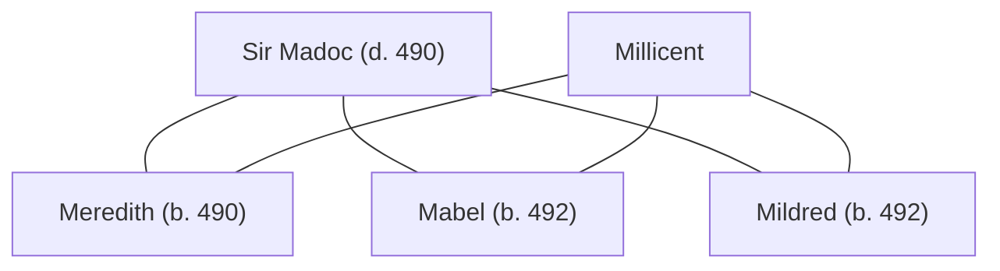

## Notes
Daughter of [[Millicent]] and [[Sir Madoc]], conceived by the end of 489 and born battleborn at the Battle of [[Lincoln]] in 490. Named **Meredith** after Madoc’s mother, [[Meredith]], the nun who comforted him during his disgrace. Uther publicly celebrates her birth as the birth of his granddaughter.

## Character sheet / birth traits
- **Battleborn:** +2 STR, Alert.
- **Birth glory:** Millicent earned **150 glory**; witnesses earned **10 glory** each.

## Lineage

**Lineage links:**
- [[Sir Madoc]]
- [[Millicent]]
- [[Meredith (daughter of Madoc and Millicent)]]
- [[Mabel (daughter of Millicent)]]
- [[Mildred (daughter of Millicent)]]

## Timeline
- **(489)** — Conceived by [[Millicent]] and [[Sir Madoc]] by year’s end; named after Madoc’s mother. *(Source: [[Session 030 - The Angel’s Command and the Child King]])*

- **(490)** — Born on the battlefield at the Battle of [[Lincoln]] after [[Millicent]] is unhorsed during the elite Saxon foot-knight fight; celebrated by [[Uther Pendragon|Uther]] as his granddaughter. *(Source: [[Session 031 - The Battle of Lincoln and the Birth of Meredith]])*
- **(490)** — Her father [[Sir Madoc]] dies from his Lincoln wounds soon after her battlefield birth, leaving her as his infant daughter and [[Uther Pendragon|Uther]]’s granddaughter in a sharpened succession crisis. *(Source: [[Session 032 - Madoc’s Funeral and the Question of Britain’s Crown]])*
- **490:** Left in the care of [[Millicent]]’s father while Millicent joins the crown/Grail quest north. *(Source: [[Session 033 - The Crown Quest, the Siege of Exeter, and the Giant Erge]])*

- **(491)** — Becomes politically important in Roderick’s succession worries: [[Count Roderick of Salisbury|Roderick]] fears Uther’s death may end the [[House of Constantine|Bloodline of Constantine]], apparently not knowing or not considering Meredith’s blessed/battleborn significance. *(Source: [[Session 038 - The Wedding Feast, the Whale Road, and the Siege of Jagent]])*
