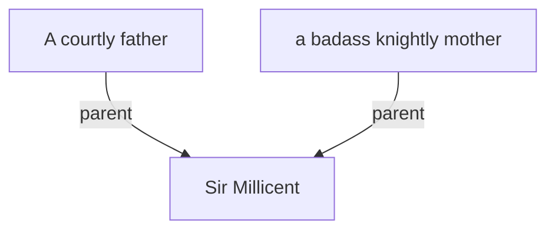

## Quick facts
- **Description:** A determined, honorable squire seeking to prove her valor and uphold the traditions of knighthood.

## Timeline
- **(485–486)** — Lowers Ælflaed’s preserved body into the Wilderspool true well as an offering; later confronts the false “Ælflaed” in York and fights the winged demon impostor. *(Source: [[Session 019 - The Well of Bargains and the Demon Princess]]; [[Session 019 — Player Synopsis — Well of Bargains and Demon Princess]])*
- **(480)** — Introduced as a squire of Salisbury. *(Source: [[Session 000 - The Young Squires of Salisbury]])*
- **(480)** — Wounded in the Purdue Forest ambush (knocked from her horse). *(Source: [[Session 003 - The Empty Castle and the Forest Ambush]])*
- **(481)** — Leads the conroi at Downton; rescues Beon and supports the High King’s extraction during the wyvern crisis. *(Source: [[Session 006 - The Shield of St. Crispin and the Fall of the Wyvern]])*
- **(483)** — Intercepts an assassin targeting Count Roderick; grievously wounded and loses a great tooth. *(Source: [[Session 013 - The Assassin’s Winter and the Escort of Lady Ellen]])*
- **(483)** — Leads the escort to retrieve Lady Ellen from Londinium; keeps a suspicious Deiran-painted shield as evidence. *(Source: [[Session 013 - The Assassin’s Winter and the Escort of Lady Ellen]])*
- **(484)** — Leads the northern march toward York; nearly killed in the Sherwood ambush; recovers after Drimant’s chant. *(Source: [[Session 015 - The Road to York and the Ambush in Sherwood]])*
- **(484)** — Orders the three brain-fed infants spared and carried into Wilderspool to be placed in proper care. *(Source: [[Session 017 - The Wyrd Pool of Wilderspool]])*
- **(484)** — Beheads the red-haired priestess at the Wyrd Pool and hauls Madoc from the waters, staunching his wound. *(Source: [[Session 017 - The Wyrd Pool of Wilderspool]])*

---

## Lineage

**Lineage links:**
- (none)
- **(487)** — Scouts the dragon chamber first and is badly wounded in the battle against the [[Dragon of the Roman Mine]]. *(Source: [[Session 023 - The Dragon Beneath the Mine]])*
- **(488)** — Marries [[Sir Madoc]] in [[Caen]] and commands in the battle to lift the siege of [[Calais]]. *(Source: [[Session 025 - The Feast at Caen and the Battle of Calais]])*
- **(488)** — Leads 500 men in five units to clear the countryside around [[Calais]], helping drive the remaining [[Franks]] south into [[Gaul]]. *(Source: [[Session 026 - The Wolves of Wildenburg]])*
- **(488)** — In the [[House of Constantine]] trial, sacrifices her own place so [[Drustin]] can continue; later secretly swaps Madoc's sword before returning the runed blade to [[Lady Wells]] at [[Wells]]. *(Source: [[Session 027 - The House of Constantine and the Return to Wells]])*
- **(488)** — Confronts [[Sir Madoc]] about the corrected [[Lady Rhianneth]] scandal and possible child, then follows his trail to [[St. Mary Bethlehem]] and recognizes the nunnery scene is not a normal Church rite. *(Source: [[Session 028 - The Easter Feast at the White Tower]])*
