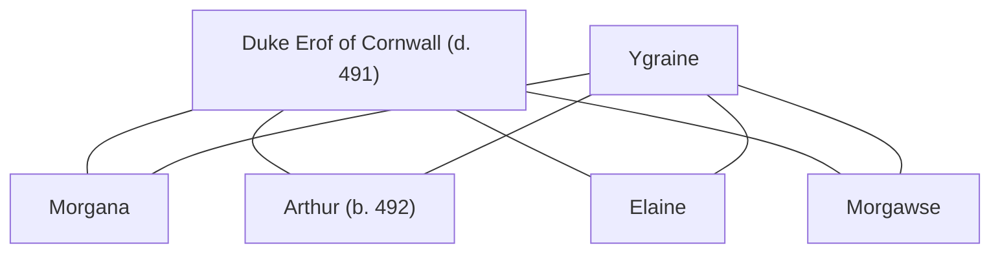

## Notes
One of [[Ygraine]]’s daughters, about fourteen, resembling her mother and interested in [[Merlin]]. Morgan/Morgana is treated as interchangeable table naming.

## Lineage

**Lineage links:**
- [[Duke Erof of Cornwall]]
- [[Ygraine]]
- [[Morgana]]
- [[Arthur]]
- [[Morgawse]]
- [[Elaine]]

## Timeline
- **(491)** — At the [[Caer Lloyw]] feast, asks [[Drustin]] whether he is Merlin’s friend and asks [[Sir Geraint]] what he knows about Merlin. She accepts placement with [[Millicent]] because Millicent knows Merlin and is close to the “Chief Merlinist,” then spends the rest of the year training as a steward for [[Heywood]]. *(Source: [[Session 041 - The Feast at Caer Lloyw and the Poisoned Boon]])*
