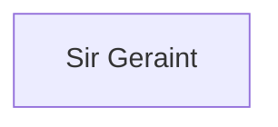

## Notes
Player: **BrotherRidge** (joined Session 12).

Only survivor of Knight Commander Caradoc's conroi after the burning of [[Dunkerton]] and a giant ambush. Found battered on the road and joins the Kenroi. Unlike most of the group, Geraint is **sworn directly to [[Count Roderick of Salisbury]]**.

## Timeline
- **(485–486)** — Drives King Eosa’s golden axe into the winged demon masquerading as Ælflaed, pinning it; the revealed demonic face drives him into madness and flight, later steadied by his companions. *(Source: [[Session 019 - The Well of Bargains and the Demon Princess]]; [[Session 019 — Player Synopsis — Well of Bargains and Demon Princess]])*
- **(482)** - Survives the Dunkerton massacre (giant ambush) and warns the Kenroi. *(Source: [[Session 012 - The Burning of Dunkerton and the Peace of Summerland]]; see also [[Session 012 — Player Synopsis — Dunkerton]]).*
- **(482)** - Argues to abort Uther's destructive mission after Dunkerton (alongside Drustin and Liam). *(Source: [[Session 012 - The Burning of Dunkerton and the Peace of Summerland]]).*
- **(482)** - Finds an overturned wagon with a partially eaten peasant family and judges the wounds were inflicted by men, not beasts. *(Source: [[Session 012 - The Burning of Dunkerton and the Peace of Summerland]]; see also [[Session 012 — Player Synopsis — Dunkerton]]).*
- **(482)** - Accompanies the deer-path shortcut toward [[Tisbury]] and is caught in the wolf ambush. *(Source: [[Session 012 - The Burning of Dunkerton and the Peace of Summerland]]; see also [[Session 012 — Player Synopsis — Dunkerton]]).*
- **(483)** - During the ogre ambush on the Ellen escort, is knocked from his horse by the ogre's uprooted tree. *(Source: [[Session 013 - The Assassin’s Winter and the Escort of Lady Ellen]]; see also [[Session 013 — Player Synopsis — Assassin Winter and Ellen Escort]]).*
- **(483)** - At Easter court, exchanges stories with [[Lady Rachel of Carbonog]] and later witnesses [[Lady Rhianneth]] force a kiss on [[Sir Madoc]] in the gardens. *(Source: [[Session 014 - Easter Court at Sarum and the Duel of Sir Marius]]; see also [[Session 014 — Player Synopsis — Easter Court and Sir Marius Duel]]).*
- **(484)** - Helps expose the "holing" pit (black-armored officials throwing peasants into pits) and fights in the Sherwood ambush; beheads a huscarl who nearly kills Millicent. *(Source: [[Session 015 - The Road to York and the Ambush in Sherwood]]; see also [[Session 015 — Player Synopsis — York Road and Sherwood Ambush]]).*
- **(484)** - On the road toward Wilderspool, is struck badly in the hag clearing fight but stays mounted. *(Source: [[Session 016 — Player Synopsis — Wilderspool and Hag of the Dead]]).*
- **(484)** — Fights at the Wyrd Pool; engages the serpent creature and deals telling blows during the rescue of Madoc and Ælflaed. *(Source: [[Session 017 - The Wyrd Pool of Wilderspool]]).* 

---
- **490:** Pursues Dubricus’ restoration quest, trades up to a proper warhorse at [[Bath]], recruits [[Brother Nerovens]] at the [[Castle of Salt]], and tracks [[Giant Erge]] near [[Stafford]]. *(Source: [[Session 033 - The Crown Quest, the Siege of Exeter, and the Giant Erge]])*

- **490:** Helps bait [[Giant Erge]] into chasing the second giant trail and lands the decisive blow against a [[Hounds of Hecate|Hound of Hecate]] at the [[Shrine of Hecate]]. *(Source: [[Session 034 - Erge, Exeter, and the Hounds of Hecate]])*

## Lineage

**Lineage links:**
- [[Sir Geraint]]
- **(487)** — Advances his courtship of [[Lady Rachel of Carbonog]], volunteers enthusiastically for the spring 488 Gaul campaign, and becomes strongly loyal to the [[Ladies of the Lake]] cause. *(Source: [[Session 024 - The Feast at Sarum and the Forest’s Warning]])*
- **(488)** — Commands "The Normans" at Calais; rallies his men with homage in the battle that lifts the siege. *(Source: [[Session 025 - The Feast at Caen and the Battle of Calais]])*
- **(488)** — Kills a werewolf at the [[Wildenburg Pagan Shrine]] and recalls folklore that lycanthropy is a Saxon affliction and not every bite turns the victim. *(Source: [[Session 026 - The Wolves of Wildenburg]])*
- **(488)** — In the [[House of Constantine]] trial, gives up his name and coat of arms and is styled the Nameless Knight. *(Source: [[Session 027 - The House of Constantine and the Return to Wells]])*
- **(488)** — Becomes the “Eastern Wind” at the [[White Tower]] feast, continues courting [[Lady Rachel of Carbonog]], and helps [[Assterius]] restrain [[Drustin]] before another Ellen disaster. *(Source: [[Session 028 - The Easter Feast at the White Tower]])*

- **(489)** — Finds refugee tracks near Brun, leads refugees toward Cambria, negotiates aid at [[Carohaig]] from young [[Leodegrance]], and later rejoins the conroi at [[Peterborough]]. *(Source: [[Session 030 - The Angel’s Command and the Child King]])*

- **(490)** — At the Battle of [[Lincoln]], charges down a wild man, trips a small giant, then nearly falls into Saxon hands while trying to aid [[Millicent]] before [[Liam]] rescues him. *(Source: [[Session 031 - The Battle of Lincoln and the Birth of Meredith]])*
- **(490)** — Still unrecognized as the Nameless Knight, appeals to [[Count Roderick of Salisbury|Roderick]] and then [[Archbishop Dubricus]]; Dubricus says a quest is needed to remove his sins and anonymity. *(Source: [[Session 032 - Madoc’s Funeral and the Question of Britain’s Crown]])*
- **490:** At [[Appleby]], treats successfully with the [[Brownies of Appleby Forest|brownies]], asks them to watch over [[Lady Appleby]], recognizes a Gore shield, and kills the [[Auroch of Appleby]] with his hammer/pollaxe. *(Source: [[Session 035 - The Battle of Tintagel and the Brownies of Appleby]])*
