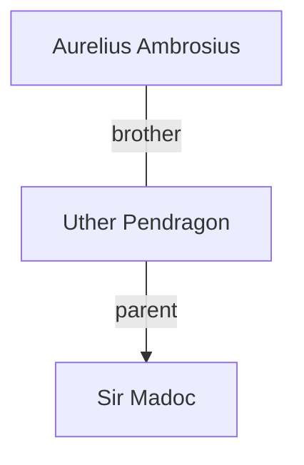

## Notes
Legitimized bastard son of Uther Pendragon; potentially significant in succession politics.

## Timeline

---

## Lineage

**Lineage links:**
- [[Uther Pendragon]]
- [[Sir Madoc]]

**Uncle:** [[Aurelius]]

- **(481)** — At the victory feast, chokes on walnuts; Millicent saves him (Heimlich), and he proclaims her his saviour. *(Source: [[Session 007 — Player Synopsis — Nightly Business]])*
- **(482)** — Gravely injured by a manticore; Millicent and Brother Maynard bring him back to safety. *(Source: [[Session 011 - The Hag of the Passage and the Lady of the Well]])*
- **(482)** — Recovering at Woodhouse from the manticore sting. *(Source: [[Session 012 - The Burning of Dunkerton and the Peace of Summerland]])*
- **(483)** — Easter Court at Sarum; Lady Rhianneth forces her attentions on him in the gardens and kisses him. *(Source: [[Session 014 - Easter Court at Sarum and the Duel of Sir Marius]])*
- **(484)** — Joins Millicent's conroi to learn warfare; during the Sherwood ambush, rushes to defend Millicent when she is nearly killed by a huscarl. *(Source: [[Session 015 - The Road to York and the Ambush in Sherwood]])*
- **(484)** — Continues with the company to York for parley and east toward Wilderspool to investigate the Well. *(Source: [[Session 016 - The Centurion-King, the Well of Wilderspool, and the Hag of the Dead]])*
- **(484)** — Abducted from Wilderspool and used in a serpent rite at the Wyrd Pool; his throat is cut and he is cast into the waters, but Millicent hauls him free and he survives—dazed and unresponsive afterward. *(Source: [[Session 017 - The Wyrd Pool of Wilderspool]])*
- **(484 / Winter)** — Saved by chirurgeons after the Serpent Lodge battle; winters in the [[City of the Legions]] before later disappearing. *(Source: [[Session 018 - The Serpent Lodge and the Fall of Ælflaed]])*
- **(485–486)** — After recovering, slips away; later revealed to be a February kidnapping-by-boat involving men claiming summons by his father and a named lead: [[Bruce]]. *(Source: [[Session 019 - The Well of Bargains and the Demon Princess]])*
- **(487)** — Sent west to [[Escavalon]] (Caerleon) to engage Saxon forces as Uther splits his renewed campaign. *(Source: [[Session 019 - The Well of Bargains and the Demon Princess]])*
