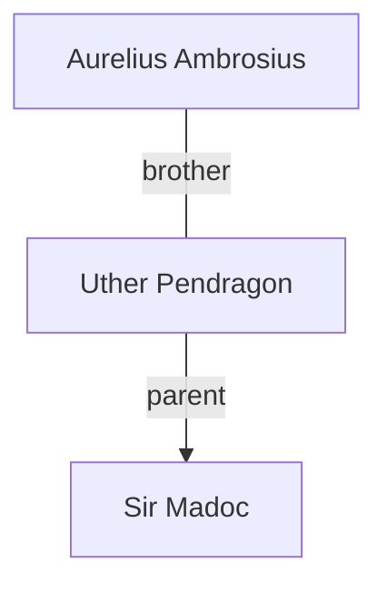

## Notes
Legitimized bastard son of Uther Pendragon; husband of [[Millicent]] and father of [[Meredith (daughter of Madoc and Millicent)|Meredith]]. Died in 490 from wounds taken at [[Lincoln]] and was buried at [[Stonehenge]].

## Character sheet snapshot

> Source: screenshots provided 2026-07-15. Keep as a quick table reference for playing Madoc.

### Core stats
| Stat | Value |
|---|---:|
| SIZ | 13 |
| DEX | 12 |
| STR | 15 |
| CON | 13 |
| APP | 15 |
| Hit Points | 26 / 26 |
| Move | 19 |
| Glory (Unproven) | 1025 |
| Damage | 5 |
| Armor | 30 / 18 |
| Money £/d | 0 / 0 |

**Conditions shown:** none checked for Debilitated, Unconscious, Near Death, Madness, Melancholy, or Misery.

### Traits
| Trait | Value | Opposed Trait | Value |
|---|---:|---|---:|
| Chaste | 13 | Lustful | 7 |
| Energetic | 16 | Lazy | 4 |
| Forgiving | 10 | Vengeful | 10 |
| Generous | 13 | Selfish | 7 |
| Honest | 10 | Deceitful | 10 |
| Just | 12 | Arbitrary | 8 |
| Merciful | 10 | Cruel | 10 |
| Modest | 13 | Proud | 7 |
| Prudent | 6 | Reckless | 14 |
| Spiritual | 10 | Worldly | 10 |
| Temperate | 13 | Indulgent | 7 |
| Trusting | 10 | Suspicious | 10 |
| Valorous | 15 | Cowardly | 5 |

### Passions / values
| Passion / value | Score |
|---|---:|
| Adoratio | 0 |
| Civilitas | 27 |
| Hospitality | 12 |
| Station | 15 |
| Fervour | 40 |
| Hate (Saxons) | 9 |
| Love (Millicent) | 16 |
| Love Family | 15 |
| Fidelitas | 28 |
| Duty (Vassals) | 10 |
| Loyalty (Companions) | 15 |
| Loyalty (King) | 3 |
| Honor | 12 |
| Honour | 12 |

### Skills
| Skill | Value | Skill | Value | Skill | Value |
|---|---:|---|---:|---|---:|
| Awareness | 6 | Orate | 11 | Horsemanship | 16 |
| Compose | 6 | Play Instrument | 6 | Spear | 7 |
| Courtesy | 13 | Recognize | 10 | Sword | 15 |
| Dancing | 7 | Religion (Specify) | 6 | Thrown Weapon | 7 |
| Falconry | 6 | Singing | 5 |  |  |
| Fashion | 16 | Stewardship | 6 |  |  |
| First Aid | 11 | Battle | 10 |  |  |
| Flirting | 13 | Bow | 6 |  |  |
| Folklore | 10 | Brawling | 11 |  |  |
| Gaming | 6 | Charge | 14 |  |  |
| Hunting | 6 | Crossbow | 7 |  |  |
| Intrigue | 10 | Hafted | 7 |  |  |
| Literacy (Specify) | 1 | Hafted - 2H | 7 |  |  |

## Timeline
- **(481)** — At the victory feast, chokes on walnuts; Millicent saves him (Heimlich), and he proclaims her his saviour. *(Source: [[Session 007 — Player Synopsis — Nightly Business]])*
- **(482)** — Gravely injured by a manticore; Millicent and Brother Maynard bring him back to safety. *(Source: [[Session 011 - The Hag of the Passage and the Lady of the Well]])*
- **(482)** — Recovering at Woodhouse from the manticore sting. *(Source: [[Session 012 - The Burning of Dunkerton and the Peace of Summerland]])*
- **(483)** — Easter Court at Sarum; Lady Rhianneth forces her attentions on him in the gardens and kisses him. *(Source: [[Session 014 - Easter Court at Sarum and the Duel of Sir Marius]])*
- **(484)** — Joins Millicent's conroi to learn warfare; during the Sherwood ambush, rushes to defend Millicent when she is nearly killed by a huscarl. *(Source: [[Session 015 - The Road to York and the Ambush in Sherwood]])*
- **(484)** — Continues with the company to York for parley and east toward Wilderspool to investigate the Well. *(Source: [[Session 016 - The Centurion-King, the Well of Wilderspool, and the Hag of the Dead]])*
- **(484)** — Abducted from Wilderspool and used in a serpent rite at the Wyrd Pool; his throat is cut and he is cast into the waters, but Millicent hauls him free and he survives—dazed and unresponsive afterward. *(Source: [[Session 017 - The Wyrd Pool of Wilderspool]])*
- **(484 / Winter)** — Saved by chirurgeons after the Serpent Lodge battle; winters in the [[City of the Legions]] before later disappearing. *(Source: [[Session 018 - The Serpent Lodge and the Fall of Ælflaed]])*
- **(485–486)** — After recovering, slips away; later revealed to be a February kidnapping-by-boat involving men claiming summons by his father and a named lead: [[Bruce]]. *(Source: [[Session 019 - The Well of Bargains and the Demon Princess]])*
- **(487)** — Sent west to [[Escavalon]] (Caerleon) to engage Saxon forces as Uther splits his renewed campaign. *(Source: [[Session 019 - The Well of Bargains and the Demon Princess]])*

---

## Lineage

```mermaid
%% AUTO-LINEAGE: sir_madoc
flowchart TB
  a["Aurelius Ambrosius"]
  u["Uther Pendragon"]
  m["Sir Madoc"]

  a ---|brother| u
  u -->|parent| m
```

**Lineage links:**
- Uther Pendragon
- Aurelius Ambrosius
- Sir Madoc

**Uncle:** Aurelius Ambrosius
- **(487)** — Present intoxicated at the [[Sarum]] feast; [[Lady Dilwen]] pursues him; named to lead Uther’s spring 488 campaign against the [[Franks]] in [[Calais]]. *(Source: [[Session 024 - The Feast at Sarum and the Forest’s Warning]])*
- **(488)** — Marries [[Millicent]] in a rushed ceremony at [[Caen]] and leads the allied battle that lifts the siege of [[Calais]]. *(Source: [[Session 025 - The Feast at Caen and the Battle of Calais]])*
- **(488)** — Helps train the [[XX Legion]] around [[Calais]] after the battle. *(Source: [[Session 026 - The Wolves of Wildenburg]])*
- **(488)** — Appears beside [[Clovis]] under the style of "King" Madoc, reports a suspicious accord with the [[Franks]] around Bayeux and [[Calais]], and claims the runed sword at his side is reforged Excalibur. *(Source: [[Session 027 - The House of Constantine and the Return to Wells]])*
- **(488)** — At the [[White Tower]] feast, admits to [[Millicent]] that the prior scandal involved [[Lady Rhianneth]] and says he does not know whether a child exists; later follows a trail to [[St. Mary Bethlehem]], where the company finds him with his head in a nun's lap. *(Source: [[Session 028 - The Easter Feast at the White Tower]])*
- **(488–489)** — At [[St. Mary Bethlehem]], revealed that the nun is his mother [[Meredith]]; seeks penance for the [[Lady Rhianneth]] scandal and possible child, then appears in 489 wearing a mouthless porcelain mask and suffering madness before being confined at [[Lambor Castle]] by [[Millicent]]. *(Source: [[Session 029 - Madoc’s Penance, New Manors, and the March]])*

- **(489)** — Claims an angel commanded him to kill the King of the Angles at [[Peterborough]], escapes [[Lambor Castle]] after an angel catches him, forges a sword at [[Folkingham]], then chooses mercy when the king proves to be the child [[King Wihtlaeg of the Angles]]. By year’s end, he and [[Millicent]] conceive [[Meredith (daughter of Madoc and Millicent)|Meredith]]. *(Source: [[Session 030 - The Angel’s Command and the Child King]])*

- **(490)** — Commands the conroi at the Battle of [[Lincoln]], is gravely wounded and stabilized by Lewis, slips back into madness, survives multiple near-death moments, and sees [[Meredith (daughter of Madoc and Millicent)|Meredith]] born on the battlefield. *(Source: [[Session 031 - The Battle of Lincoln and the Birth of Meredith]])*
- **(490)** — Dies from his Lincoln wounds after worsening on the southward journey: unwell at Ansty, left leg amputated at Kineton, left arm amputated at Corinium, and death at [[Bath]]. He is buried at [[Stonehenge]] beside his uncle, likely [[Aurelius]]. *(Source: [[Session 032 - Madoc’s Funeral and the Question of Britain’s Crown]])*
- **490:** Appears to [[Millicent]] on a night beach in the fountain-vision, troubled more by his failures as a future king than by relationship mistakes; neither can pray their way home. *(Source: [[Session 036 - The Sun-Water of Loch Lomond and the Road to Merlin]])*
