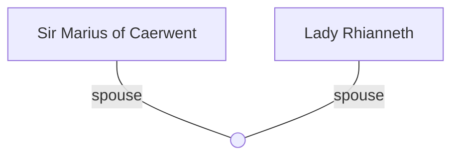

## Notes
Knight Commander from Caerwent. Provoked into dueling Asterius at Sarum; beheaded in a single stroke.

## Timeline
- **(483)** — Challenges Asterius and is decapitated. *(Source: [[Session 014 - Easter Court at Sarum and the Duel of Sir Marius]])*

---

## Lineage

**Lineage links:**
- [[Sir Marius of Caerwent]]
- [[Lady Rhianneth]]

