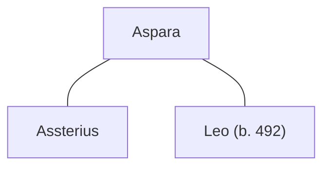

## Notes
A squire present at the victory feast. Rumored “amazon” ancestry (grandmother). Later revealed (in conversation) to be **Alanic**, part of the Sarmatian confederation; speaks Greek. Her uncle is [[Aspar]].

## Lineage

**Lineage links:**
- [[Squire Aspara]]
- [[Assterius]]
- [[Leo (son of Assterius and Aspara)]]

## Timeline
- **(481)** — Present at the feast; converses in Greek and is identified as Alanic. *(Source: [[Session 007 — Player Synopsis — Nightly Business]])*
- **(482)** — Joins the fighting in the ogre cave during the Wells expedition (Kenian’s enschild). *(Source: [[Session 010 - The Silent Town of Wells and the Ogre of the Marsh]])*
- **(490)** — Flirts with [[Assterius|Asterius]] at [[Sir Madoc]]’s funeral feast after he mentions following her advice about comfortable riding clothes. *(Source: [[Session 032 - Madoc’s Funeral and the Question of Britain’s Crown]])*

- **(491)** — Courted by [[Assterius]] after the [[Caer Lloyw]] feast; Roderick approves and sponsors the wedding, and she marries Assterius. *(Source: [[Session 041 - The Feast at Caer Lloyw and the Poisoned Boon]])*
- **(491–492 / Winter)** — Conceives a son, [[Leo (son of Assterius and Aspara)|Leo]], with [[Assterius]]. *(Source: [[Session 042 - The Treason Summons at Tintagel and the Missing Heir]])*
