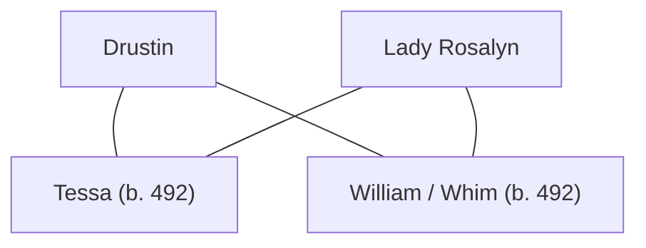

## Notes
Child of [[Drustin]] recorded during the same winter/family phase.

## Lineage

**Lineage links:**
- [[Drustin]]
- [[Lady Rosalyn]]
- [[Tessa (child of Drustin)]]
- [[William Whim (child of Drustin)]]

## Timeline
- **(491–492 / Winter)** — Recorded during winter/family phase. *(Source: [[Session 042 - The Treason Summons at Tintagel and the Missing Heir]])*
