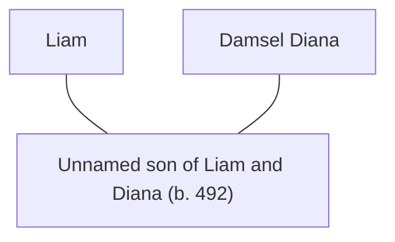

## Notes
Male child conceived by [[Liam]] and [[Damsel Diana]]; name not yet recorded.

## Lineage

**Lineage links:**
- [[Liam]]
- [[Damsel Diana]]
- [[Unnamed son of Liam and Diana]]

## Timeline
- **(491–492 / Winter)** — Conceived during winter/family phase. *(Source: [[Session 042 - The Treason Summons at Tintagel and the Missing Heir]])*
