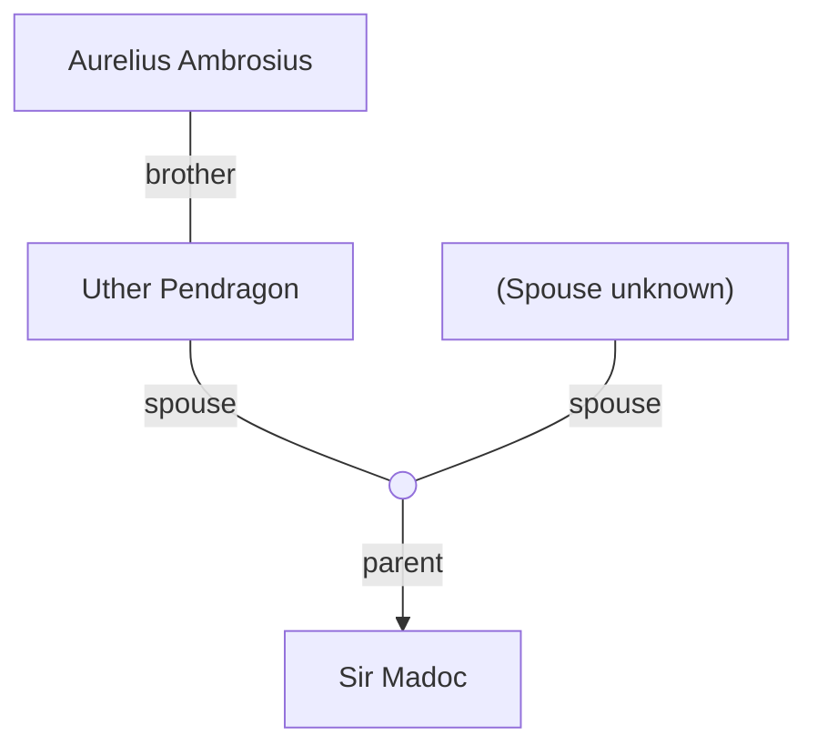

## Notes
Referenced during the victory feast: known for lecherous ways and lacking trueborn sons; his legitimized bastard son is [[Sir Madoc]].

## Timeline
- **(481)** — Mentioned in succession context via Sir Madoc. *(Source: [[Session 007 — Player Synopsis — Nightly Business]])*
- **(481)** — Musters loyal knights at Leicester and punishes Bedegraine; later is made King of Logres and turns ambition toward invading Summerland. *(Source: [[Session 009 - The Death of Aurelius and the Fall of Bedegraine]])*
- **(482)** — Ordered knights to compel oaths at Wells; towns found abandoned or fled. *(Source: [[Session 010 - The Silent Town of Wells and the Ogre of the Marsh]])*
- **(482)** — Signed peace with King Cadwy of Summerland, granting him title Count of Somerset; arranged marriage of Lady Ellen to Count Roderick. *(Source: [[Session 012 - The Burning of Dunkerton and the Peace of Summerland]])*
- **(483)** — At Easter court, knighted four-year-old Lucius and proclaimed him Duke of Saxon Shore. *(Source: [[Session 014 - Easter Court at Sarum and the Duel of Sir Marius]])*
- **(484)** — Prepared campaign against York after Malahaut appealed for assistance against Saxon invasion. *(Source: [[Session 015 - The Road to York and the Ambush in Sherwood]])*
- **(485–486)** — Suffers major reversals in the north: wounded in the York campaign; Excalibur is shattered against Eosa without harming him. *(Source: [[Session 019 - The Well of Bargains and the Demon Princess]])*

---

## Lineage

**Lineage links:**
- Uther Pendragon
- Aurelius Ambrosius
- Sir Madoc

