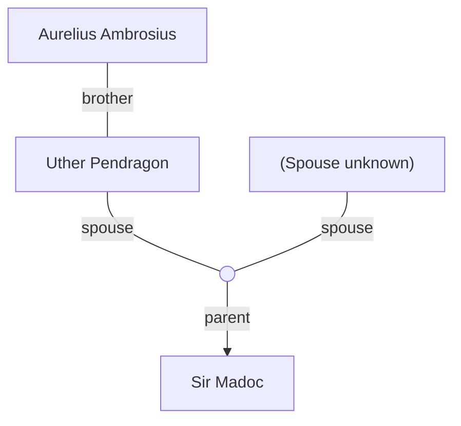

## Notes
Referenced during the victory feast: known for lecherous ways and lacking trueborn sons; his legitimized bastard son is [[Sir Madoc]].

## Timeline
- **(481)** — Mentioned in succession context via Sir Madoc. *(Source: [[Session 007 — Player Synopsis — Nightly Business]])*
- **(481)** — Musters loyal knights at Leicester and punishes Bedegraine; later is made King of Logres and turns ambition toward invading Summerland. *(Source: [[Session 009 - The Death of Aurelius and the Fall of Bedegraine]])*
- **(482)** — Ordered knights to compel oaths at Wells; towns found abandoned or fled. *(Source: [[Session 010 - The Silent Town of Wells and the Ogre of the Marsh]])*
- **(482)** — Signed peace with King Cadwy of Summerland, granting him title Count of Somerset; arranged marriage of Lady Ellen to Count Roderick. *(Source: [[Session 012 - The Burning of Dunkerton and the Peace of Summerland]])*
- **(483)** — At Easter court, knighted four-year-old Lucius and proclaimed him Duke of Saxon Shore. *(Source: [[Session 014 - Easter Court at Sarum and the Duel of Sir Marius]])*
- **(484)** — Prepared campaign against York after Malahaut appealed for assistance against Saxon invasion. *(Source: [[Session 015 - The Road to York and the Ambush in Sherwood]])*
- **(485–486)** — Suffers major reversals in the north: wounded in the York campaign; Excalibur is shattered against Eosa without harming him. *(Source: [[Session 019 - The Well of Bargains and the Demon Princess]])*

---
- **490:** Marches on [[Exeter]] to kill [[Duke Erof of Cornwall|Gorlois]] and take [[Ygraine]]; after [[Drustin]] reports the castle may be lightly held, orders an immediate assault. *(Source: [[Session 033 - The Crown Quest, the Siege of Exeter, and the Giant Erge]])*

## Lineage

```mermaid
%% AUTO-LINEAGE: uther_pendragon
flowchart TB
  a["Aurelius Ambrosius"]
  u["Uther Pendragon"]
  m["Sir Madoc"]
  sp["(Spouse unknown)"]
  marriage(( ))

  a ---|brother| u

  u ---|spouse| marriage
  sp ---|spouse| marriage

  marriage -->|parent| m
```

**Lineage links:**
- Uther Pendragon
- Aurelius Ambrosius
- Sir Madoc
- **(487)** — Calls for volunteers for a spring 488 campaign into Gaul/France to drive the [[Franks]] from [[Calais]], with [[Sir Madoc]] leading. *(Source: [[Session 024 - The Feast at Sarum and the Forest’s Warning]])*
- **(488)** — At the [[White Tower]] Easter feast, becomes openly obsessed with [[Ygraine]] and leaves upset; his tracks lead toward [[Llud’s Castle]]. *(Source: [[Session 028 - The Easter Feast at the White Tower]])*

- **(490 / Spring)** — Reconciled with [[Duke Erof of Cornwall]] through [[Merlin]]’s urging and arrives with a combined army to march north against the Saxons. *(Source: [[Session 030 - The Angel’s Command and the Child King]])*

- **(490 / Spring)** — Wins the Battle of [[Lincoln]] with [[Duke Erof of Cornwall]] and calls a feast to celebrate both the victory and the battlefield birth of his granddaughter [[Meredith (daughter of Madoc and Millicent)|Meredith]]. *(Source: [[Session 031 - The Battle of Lincoln and the Birth of Meredith]])*
- **(490)** — After [[Sir Madoc]] dies from his wounds, Uther is disturbed but quickly focuses on producing another heir; at Madoc’s funeral feast, his desire for [[Ygraine]] becomes openly dangerous and strains the peace with [[Duke Erof of Cornwall|Gorlois]]. *(Source: [[Session 032 - Madoc’s Funeral and the Question of Britain’s Crown]])*
- **490:** Begins the siege of [[Tintagel]] after Cornish forces are driven back into the fortress; furious at the council, he focuses on preventing [[Duke Erof of Cornwall|Gorlois]] and [[Ygraine]] from escaping. *(Source: [[Session 035 - The Battle of Tintagel and the Brownies of Appleby]])*
