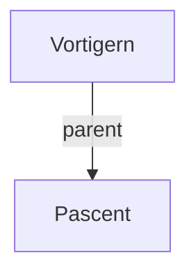

## Notes
Deposed High King referenced in the campaign: [[Pascent]] is described as his son, leading Irish forces against Salisbury.

---

## Lineage

**Lineage links:**
- [[Vortigern]]
- [[Pascent]]

