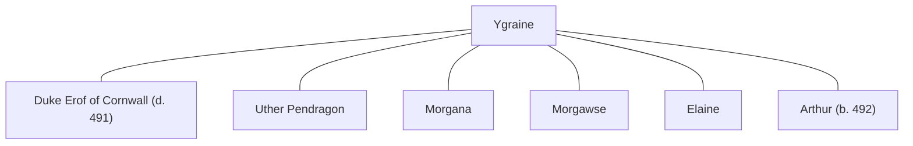

## Notes
Wife of [[Duke Erof of Cornwall]]. Her arrival at [[Uther Pendragon|Uther]]'s Easter feast at the [[White Tower]] immediately destabilizes the court: the company is struck by adoration or jealousy, and Uther becomes openly obsessed with her.

## Lineage

**Lineage links:**
- [[Ygraine]]
- [[Duke Erof of Cornwall]]
- [[Uther Pendragon]]
- [[Morgana]]
- [[Morgawse]]
- [[Elaine]]
- [[Arthur]]

## Timeline
- **(488)** — Appears at the White Tower Easter feast with [[Duke Erof of Cornwall]]; Uther's pursuit of her becomes the central political danger of the feast. *(Source: [[Session 028 - The Easter Feast at the White Tower]])*
- **(490)** — At [[Sir Madoc]]’s funeral feast, court gossip links her beauty to ancient noble or fairy ancestry; Uther’s obvious desire for her and a misunderstanding involving [[Liam]] lead her and [[Duke Erof of Cornwall|Erof]] to leave under a cloud. *(Source: [[Session 032 - Madoc’s Funeral and the Question of Britain’s Crown]])*
- **490:** Uther’s desire for her drives the campaign against [[Exeter]] and [[Duke Erof of Cornwall|Erof]]. *(Source: [[Session 033 - The Crown Quest, the Siege of Exeter, and the Giant Erge]])*
- **490:** Believed to be inside or tied to [[Tintagel]] as Uther establishes the siege and seeks to prevent escape. *(Source: [[Session 035 - The Battle of Tintagel and the Brownies of Appleby]])*
- **490:** A Duchess, likely Ygraine, watches [[Liam]] and [[Drustin]] from the shadows at [[Glastonbury]] as they leave; identity remains slightly uncertain in the log. *(Source: [[Session 036 - The Sun-Water of Loch Lomond and the Road to Merlin]])*
- **491:** Leaves [[Castle Jagent]] with [[Uther Pendragon|Uther]] after Liam’s breach, [[Duke Erof of Cornwall|Erof]]’s death, and the defenders’ surrender. *(Source: [[Session 040 - The Breach at Jagent]])*
- **(492)** — Now queen, pregnant at [[Tintagel]], then mother of [[Arthur]]. She intercedes so [[Millicent]] is not formally accused in the treason case, and appears at trial in mourning black. *(Source: [[Session 042 - The Treason Summons at Tintagel and the Missing Heir]])*
