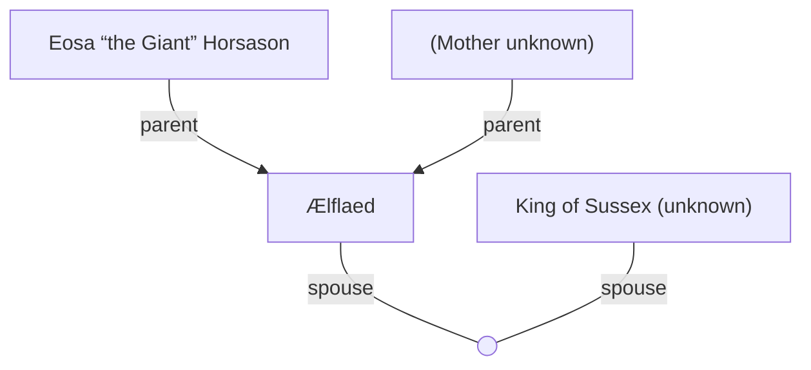

## Notes
A stunningly beautiful Saxon warrior (described as a Saxon princess) encountered in the Sherwood ambush. Her beauty appears to have a bewitching effect on observers.

## Timeline
- **(485–486)** — Her preserved body is offered into the Wilderspool true well; a demonic impostor later appears in York wearing her face and is slain. *(Source: [[Session 019 - The Well of Bargains and the Demon Princess]]; [[Session 019 — Player Synopsis — Well of Bargains and Demon Princess]])*
- **(484)** — Appears in Sherwood ambush; knocked unconscious by Drimant. *(Source: [[Session 015 - The Road to York and the Ambush in Sherwood]])*
- **(484)** — Captive on the road to York; reveals her Wilderspool sacrifice mission and uses magical slippers to teleport into combat. *(Source: [[Session 016 - The Centurion-King, the Well of Wilderspool, and the Hag of the Dead]]).* 
- **(484)** — Knocked unconscious in the hag clearing and requires chirurgery. *(Source: [[Session 016 - The Centurion-King, the Well of Wilderspool, and the Hag of the Dead]])*
- **(484)** — Taken into Wilderspool by serpent-marked surgeons, then abducted to the Wyrd Pool rite; survives rescue but remains dazed and unresponsive afterward. *(Source: [[Session 017 - The Wyrd Pool of Wilderspool]])*
- **(484)** — Returns to the [[Serpent Lodge]] battle via magical teleportation, is mortally wounded, and dies in the fight. *(Source: [[Session 018 - The Serpent Lodge and the Fall of Ælflaed]])*

---

## Lineage

**Lineage links:**
- [[Ælflaed]]
- [[King of Sussex (unknown)]]
- [[Eosa “the Giant” Horsason]]

